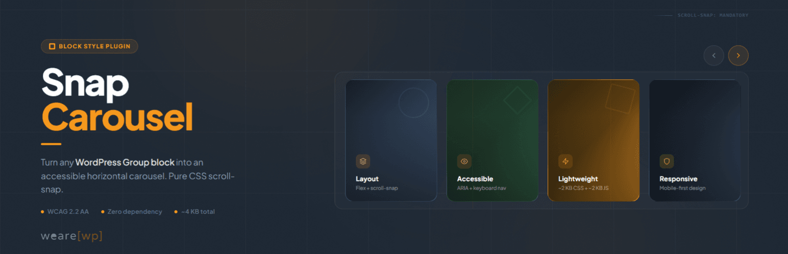
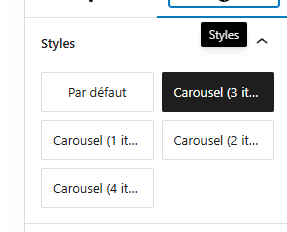

# Snap Carousel — Block Style

[](https://wordpress.org)
[](https://www.php.net)
[](https://www.gnu.org/licenses/gpl-2.0.html)
[](#changelog)
[](#accessibility-wcag-22-aa)

> Accessible carousel for Group, Query Loop & Gallery blocks. WCAG 2.2 AA, CSS scroll-snap, keyboard navigation, zero dependency.

Most WordPress carousel plugins load heavy libraries (Slick, Swiper, jQuery) and fail basic accessibility checks. Screen readers can't navigate them, keyboard users are stuck, and WCAG audits flag them every time.

Snap Carousel takes a different approach: **CSS scroll-snap does the scrolling, proper ARIA attributes do the rest.** No JavaScript library, no configuration panel, no learning curve — just a block style to apply in one click.

Built by [WeAre\[WP\]](https://www.wearewp.pro), a WordPress agency specializing in accessible websites and RGAA audits. This plugin exists because we needed a carousel that actually passes our own audits.

### Supported blocks

Apply any of the 4 carousel styles to:

- **Group block** (`core/group`) — any child blocks become slides
- **Query Loop block** (`core/query`) — posts scroll as carousel slides
- **Gallery block** (`core/gallery`) — images scroll as carousel slides

### Variants

- **Carousel (3 items)** — 3 visible items + peek
- **Carousel (1 item)** — full-width slideshow
- **Carousel (2 items)** — 2 visible items + peek
- **Carousel (4 items)** — 4 visible items + peek

## Features

- 100% CSS scroll-snap — no Slick, no Swiper, no jQuery
- Prev/next navigation buttons
- Keyboard navigation (Arrow keys, Home, End)
- Full ARIA attributes (`role="region"`, `aria-roledescription`, `aria-live`)
- **Peek effect**: partial visibility of the next item, signaling scrollable content
- Responsive (auto tablet/mobile adaptation)
- Respects `prefers-reduced-motion`
- Works with Group, Query Loop, and Gallery blocks
- Works with any child block (images, columns, groups, WooCommerce…)
- Lightweight: ~2 KB CSS + ~2 KB JS, zero external dependency
- Full RTL (right-to-left) language support
- Fully internationalized (i18n ready, French translation included)
- Easy to customize via CSS custom properties or overrides

## Accessibility (WCAG 2.2 AA)

- `role="region"` + `aria-roledescription="carousel"` on the container
- `role="group"` + `aria-roledescription="slide"` on each item
- `aria-label="X of Y"` for position context
- `tabindex="0"` for keyboard focus
- `aria-live="polite"` to announce changes
- Buttons with `aria-label` and `aria-controls`
- Touch targets 44×44px minimum
- Visible focus indicator

## Installation

1. Download the latest release or clone this repository
2. Upload the `snap-carousel-block-style` folder to `/wp-content/plugins/`
3. Activate the plugin in the Plugins menu

## Usage

### With a Group block

1. In the editor, create a **Group** block
2. Set the group layout to **Row**
3. Add child blocks (images, groups, columns…)
4. In the sidebar panel → Styles → choose **Carousel (3 items)** (or another variant)
5. Publish



### With a Query Loop block

1. Insert a **Query Loop** block
2. Configure the query (post type, filters, number of items…)
3. In the sidebar panel → Styles → choose a Carousel variant
4. Publish — posts scroll horizontally as carousel slides

### With a Gallery block

1. Insert a **Gallery** block and add images
2. In the sidebar panel → Styles → choose a Carousel variant
3. Publish — images scroll horizontally as carousel slides

Navigation buttons and accessibility attributes are automatically injected on the front-end.


## Customization

The carousel is designed to work out of the box, but you can easily override styles in your theme's `style.css` or via the WordPress Customizer > Additional CSS.

### Disable the peek effect

By default, items are slightly narrower than the visible area so the next item "peeks" in — signaling there is more content to scroll. To disable this and show full-width items:

```css
/* Disable peek — 3 items variant */
.is-style-snap-carousel > * {
    flex-basis: calc(33.333% - 1rem) !important;
}

/* Disable peek — 1 item variant */
.is-style-snap-carousel-single > * {
    flex-basis: 100% !important;
}

/* Disable peek — 2 items variant */
.is-style-snap-carousel-duo > * {
    flex-basis: calc(50% - 0.75rem) !important;
}

/* Disable peek — 4 items variant */
.is-style-snap-carousel-quad > * {
    flex-basis: calc(25% - 1.125rem) !important;
}
```

### Customize navigation arrows

```css
/* Arrow color and background */
.snap-carousel-prev,
.snap-carousel-next {
    background: #0073aa;
    color: #ffffff;
    border-color: #0073aa;
}

/* Arrow hover state */
.snap-carousel-prev:hover,
.snap-carousel-next:hover {
    background: #005177;
    color: #ffffff;
}

/* Arrow size (default: 44px — WCAG minimum touch target) */
.snap-carousel-prev,
.snap-carousel-next {
    width: 48px;
    height: 48px;
}

/* Square arrows instead of round */
.snap-carousel-prev,
.snap-carousel-next {
    border-radius: 8px;
}
```

### Customize spacing

```css
/* Gap between items */
[class*="is-style-snap-carousel"] {
    gap: 2rem;
}

/* Space above carousel (room for navigation) */
.snap-carousel-wrapper {
    padding-top: 4rem;
}
```

### Customize focus indicator

```css
/* Custom focus color for keyboard navigation */
[class*="is-style-snap-carousel"]:focus-visible {
    outline-color: #ff6600;
    outline-width: 3px;
}

.snap-carousel-prev:focus-visible,
.snap-carousel-next:focus-visible {
    outline-color: #ff6600;
}
```

### Use with WordPress theme.json design tokens

The carousel already uses `--wp--preset--color--base`, `--wp--preset--color--contrast` and `--wp--preset--color--primary` tokens. You can override these per-block in theme.json or via CSS:

```css
/* Example: dark themed carousel */
.snap-carousel-wrapper {
    --wp--preset--color--base: #1a1a2e;
    --wp--preset--color--contrast: #e0e0e0;
    --wp--preset--color--primary: #e94560;
}
```

<details>
<summary><strong>FAQ</strong></summary>

### Does this plugin work with any WordPress theme?

Yes. Snap Carousel uses standard WordPress Block Styles API and CSS custom properties. It works with any block theme (FSE) and most classic themes that support the Group block in Row layout. The navigation arrows automatically adapt to your theme's colors via `--wp--preset--color--*` design tokens.

### What types of content can I put inside the carousel?

Any block that WordPress allows inside a Group, Query Loop, or Gallery block: images, columns, groups, cover blocks, WooCommerce product blocks, custom HTML… The carousel applies horizontal scroll-snap to the block's direct children (or posts/images for Query Loop and Gallery).

### Is this plugin accessible?

Yes. Accessibility was a core design goal, not an afterthought. The carousel meets WCAG 2.2 AA requirements: full ARIA carousel pattern (`role="region"`, `aria-roledescription`, `aria-live`), keyboard navigation (Arrow keys, Home, End), 44×44px minimum touch targets, visible focus indicators, and `prefers-reduced-motion` support.

### What is the "peek" effect?

By default, items are slightly narrower than the visible area, so the next item is partially visible — signaling that there is more content to scroll. This is a well-known UX pattern that improves discoverability, especially on touch devices where navigation arrows may not be visible. You can disable it with a simple CSS override (see the [Customization](#customization) section).

### Will this plugin slow down my site?

No. The total footprint is approximately 2 KB CSS + 2 KB JS (minified), with zero external dependencies. Assets are only loaded on pages that actually contain a carousel, so there is no performance penalty on other pages.

### Can I use different carousel variants on the same page?

Yes. Each block independently gets its own style. You can have a 1-item slideshow hero at the top, a 3-item carousel in the middle, and a 4-item grid-style carousel at the bottom — all on the same page.

### What happens if I deactivate the plugin?

Your content remains intact. Blocks revert to their default layout. No data is lost — the plugin only adds a visual style and does not modify your content in the database.

### Can I customize the carousel appearance?

Absolutely. The plugin uses WordPress design tokens and semantic CSS classes. You can override arrow colors, sizes, shapes, spacing, focus indicators, and even disable the peek effect — all via simple CSS. See the [Customization](#customization) section for copy-paste examples.

### Does it work with WooCommerce?

Yes. You can wrap WooCommerce product blocks inside a Group block, apply a carousel style, and it works out of the box. This is a great way to showcase featured products.

### Does the carousel auto-play?

No, intentionally. Auto-playing carousels are a well-documented accessibility barrier (WCAG 2.2.2 Pause, Stop, Hide) and tend to lower engagement. The carousel is user-driven: scroll, swipe, keyboard, or click the navigation arrows.

### Can I use the carousel with a Query Loop block?

Yes. Since version 1.0.4, you can apply any carousel style directly to a Query Loop block. Posts are rendered as horizontal slides with full ARIA attributes. This is ideal for "latest posts" or "related posts" sections.

### Can I use the carousel with a Gallery block?

Yes. Apply a carousel style to any Gallery block and images scroll horizontally. The gallery caption (figcaption) is preserved and excluded from the carousel slides.

### How does this compare to Slick, Swiper, or other carousel libraries?

Snap Carousel does not use any JavaScript carousel library. Scrolling is handled entirely by CSS scroll-snap, which is native to all modern browsers. JavaScript is only used for navigation buttons, keyboard handling, and screen reader announcements (~2 KB). This means fewer conflicts, better performance, and no library updates to track.

### Does this plugin pass RGAA / WCAG accessibility audits?

Yes. The plugin was built specifically to pass RGAA and WCAG 2.2 AA audits. It implements the WAI-ARIA carousel pattern: `role="region"`, `aria-roledescription="carousel"` on the container, `role="group"` on each slide, `aria-live` region for announcements, keyboard navigation (Arrow, Home, End), and 44×44px minimum touch targets.

### Does the carousel support RTL languages?

Yes. The carousel detects the page direction automatically. In RTL mode (Arabic, Hebrew, etc.), items flow from right to left, navigation arrows adapt their direction, and keyboard navigation (ArrowLeft/ArrowRight) follows the expected visual direction.

### Why does the Group justification setting have no effect on the carousel?

The carousel requires items to flow from the start edge for CSS scroll-snap to work properly. The justification control (left, center, right, space-between) is automatically overridden to ensure correct scroll behavior. This is a browser constraint, not a plugin limitation.

</details>

## Technical Notes

- CSS overrides `flex-wrap: nowrap` on the Row container to force horizontal scrolling
- Items use a slightly reduced `flex-basis` to create a peek effect (next item partially visible)
- Navigation buttons are positioned `absolute` at the top right (adjust `top` value for your theme)
- JS uses a 150ms debounce on scroll for button state updates and 300ms for screen reader announcements
- Compatible with WooCommerce blocks (products, etc.)

<details>
<summary><strong>Changelog</strong></summary>

### 1.0.4

- New: Query Loop block support — apply carousel styles to `core/query` blocks, posts scroll as slides
- New: Gallery block support — apply carousel styles to `core/gallery` blocks, images scroll as slides
- Enhancement: extracted shared PHP helpers for DRY rendering across block types
- Enhancement: gallery `figcaption` excluded from carousel slides (CSS + JS)
- Enhancement: responsive rules for Query Loop and Gallery variants (tablet + mobile)
- Enhancement: editor preview CSS for Query Loop and Gallery blocks

### 1.0.3

- Fix: unique prefixes (`wearewp_snapcarousel`) for all defines, filters, handles and JS globals — WordPress.org Plugin Review compliance
- Fix: version constant centralized as `WEAREWP_SNAPCAROUSEL_VERSION`
- New: GitHub Actions release workflow for automated ZIP packaging

### 1.0.2

- Fix: Group justification (center, right, space-between) no longer breaks the carousel
- New: full RTL (right-to-left) language support — navigation, keyboard, and scroll detection
- Fix: improved scroll end detection tolerance for sub-pixel rounding
- Enhancement: navigation buttons use CSS logical properties (inset-inline-end)

### 1.0.1

- Fix: text domain aligned with plugin slug (snap-carousel-block-style)
- Fix: removed deprecated `load_plugin_textdomain()` call
- Fix: removed Domain Path header (not needed for wordpress.org hosted plugins)

### 1.0.0

- Initial release
- 4 carousel style variations (1, 2, 3, 4 items)
- Peek effect enabled by default (partial next item visible as scroll affordance)
- Full WCAG 2.2 AA accessibility
- i18n ready with French (fr_FR) translation
- CSS customization examples included in readme

</details>

## About

Snap Carousel is built and maintained by [WeAre\[WP\]](https://www.wearewp.pro), a French WordPress agency specializing in accessible websites and RGAA compliance audits. This plugin was built to solve a real problem: every carousel plugin we audited failed basic accessibility requirements. So we built one that passes our own audits.

Need help with your WordPress project? [Get in touch](https://www.wearewp.pro/contact).

## License

This project is licensed under the GPL-2.0-or-later — see the [LICENSE](LICENSE) file for details.
